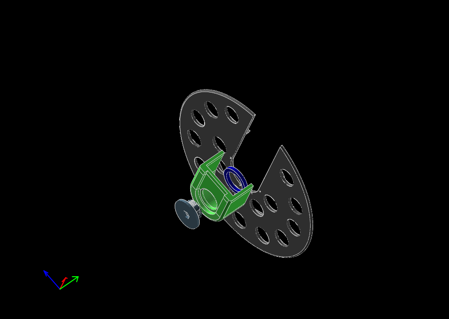

# Chaindisk

tags: chaindisk, chain protection

The plastic chain case on my bike was broken, so I made a temporary replacement.  

I designed this **chain disk** using [Solvespace](https://solvespace.com/) and [OpenSCAD](https://www.openscad.org/) as a *permanent temporary replacement* ;-). It's still working after many months, printed in PLA.

## Parts
- `coverplate-v2.slvs` – Protects your pants.
- `fixture.slvs` – Glued to the coverplate; holds the disk in place.
- `washer.slvs` – Adjusts the distance to the chain.
- `Monteringsbolt-21_125.stl` – a 21mm × 1.25 threaded "bolt" that screws into the crankshaft to hold everything in place.
  - Use OpenSCAD and the file `Monteringsbolt.scad` if you need other dimensions.

## Instructions

1. Glue the fixture and the disk together.  
   - The holes help with alignment, and you can add wire for extra strength if needed (I did not).  
2. Place the assembly on the chainring.  
3. Screw the bolt into the crankshaft.  
4. If the disk is too close to the chainring, use the washer to adjust the spacing.

## Notes
- This design is meant as a practical, long-lasting stopgap rather than a perfect replacement.  
- The files can be opened and modified with **Solvespace** or **OpenSCAD** if you want to customize them.  
- Printed in PLA, but any strong, durable filament should work.

## References
- [Solvespace – 3D CAD for Mechanical Design](https://solvespace.com/)  
- [OpenSCAD – The Programmers Solid 3D CAD Modeller](https://www.openscad.org/)
